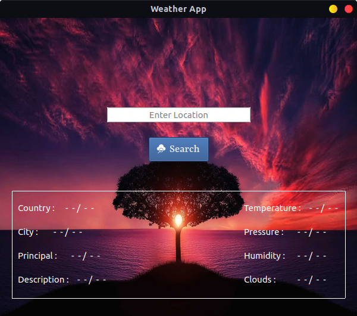

# Weather App 
Get the weather of all city around the World <br>

<p>

</p><br>

## Pre-Requisite 

1- Install Python3 <br>
2- Install <b>pyqt5</b> and <b>pyqt5-tools modules</b>
```
python3 -m pip install pyqt5 pyqt5-tools
```

### How to use ?

Just run <em>main.py</em> file like:
```
python3 main.py
```
